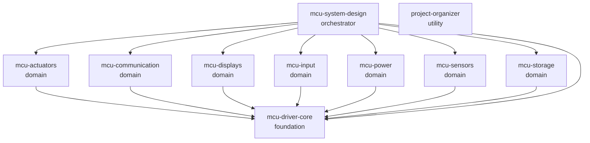

# Skill 依赖图

> 此文件由 `python3 tools/skill_registry.py --write` 生成，请勿手工编辑。

## 直接依赖

| Skill | 层级 | 直接依赖 | 安装入口 |
|-------|------|----------|----------|
| `mcu-driver-core` | `foundation` | 无 | [`SKILL.md`](../skills/mcu-driver-core/SKILL.md) |
| `mcu-actuators` | `domain` | `mcu-driver-core` | [`SKILL.md`](../skills/mcu-actuators/SKILL.md) |
| `mcu-communication` | `domain` | `mcu-driver-core` | [`SKILL.md`](../skills/mcu-communication/SKILL.md) |
| `mcu-displays` | `domain` | `mcu-driver-core` | [`SKILL.md`](../skills/mcu-displays/SKILL.md) |
| `mcu-input` | `domain` | `mcu-driver-core` | [`SKILL.md`](../skills/mcu-input/SKILL.md) |
| `mcu-power` | `domain` | `mcu-driver-core` | [`SKILL.md`](../skills/mcu-power/SKILL.md) |
| `mcu-sensors` | `domain` | `mcu-driver-core` | [`SKILL.md`](../skills/mcu-sensors/SKILL.md) |
| `mcu-storage` | `domain` | `mcu-driver-core` | [`SKILL.md`](../skills/mcu-storage/SKILL.md) |
| `mcu-system-design` | `orchestrator` | `mcu-driver-core`、`mcu-sensors`、`mcu-actuators`、`mcu-displays`、`mcu-communication`、`mcu-storage`、`mcu-power`、`mcu-input` | [`SKILL.md`](../skills/mcu-system-design/SKILL.md) |
| `project-organizer` | `utility` | 无 | [`SKILL.md`](../skills/project-organizer/SKILL.md) |
