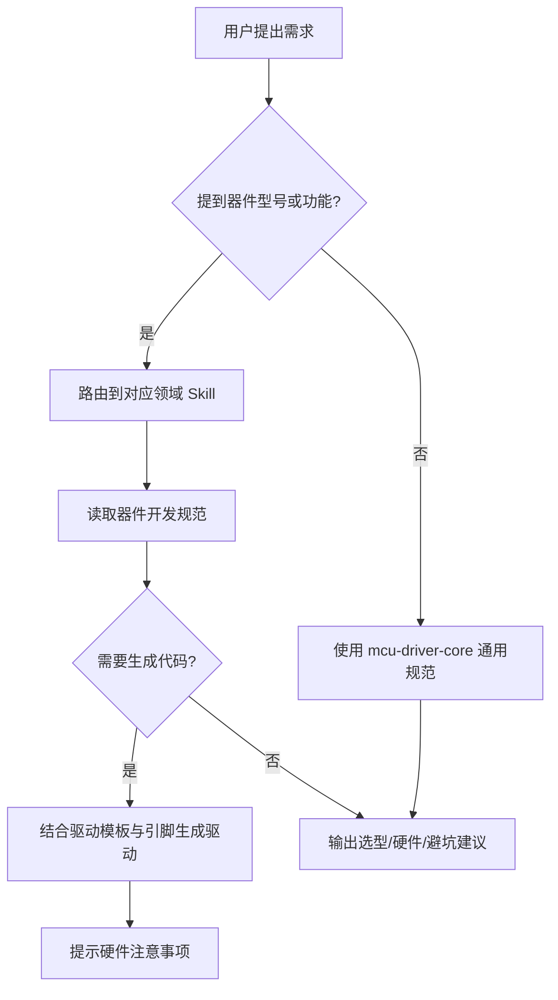

<!-- NOTE: 本文件中的示例路径为相对简写（如 examples/ds18b20/），实际路径为 skills/<skill>/examples/ -->
# Skills 项目手册

> 生成时间：2026-07-11
> 整合功能清单、硬件清单和使用说明。

---

## 1. 项目概述

MCU 嵌入式开发 Skill 知识库，覆盖传感器、执行器、显示、通信、输入、存储、电源管理的选型、硬件设计、驱动实现与调试。

### 架构分层

| 层级 | Skill | 说明 |
|------|-------|------|
| foundation | `→ mcu-driver-core` | 驱动模板、HAL 抽象、硬件设计、调试规范 |
| domain | `→ mcu-sensors` | 温度/湿度/压力/光照/IMU/气体/粉尘/测距/GPS |
| domain | `→ mcu-actuators` | 电机/舵机/继电器/蜂鸣器/音频 |
| domain | `→ mcu-displays` | OLED/LCD/TFT/电子纸/LED 点阵 |
| domain | `→ mcu-communication` | WiFi/蓝牙/LoRa/CAN/RS485/NFC/以太网 |
| domain | `→ mcu-input` | 编码器/键盘/触摸/指纹/语音/视觉 |
| domain | `→ mcu-storage` | EEPROM/Flash/SD 卡/FRAM/RTC |
| domain | `→ mcu-power` | LDO/DC-DC/充电/监控/保护 |
| orchestrator | `→ mcu-system-design` | 系统架构/低功耗/OTA/端到端示例 |
| utility | `project-organizer` | 项目扫描/规范化/文档生成 |

---

## 2. 功能清单

### 2.1 mcu-driver-core — 驱动开发核心

| 编号 | 功能 | 文件 |
|------|------|------|
| 2.1.1 | 统一驱动 API 模板 | `→ templates/driver-template.h` |
| 2.1.2 | I2C 驱动模板 | `→ templates/driver-template-i2c.c` |
| 2.1.3 | SPI 驱动模板 | `→ templates/driver-template-spi.c` |
| 2.1.4 | UART/AT 指令模板 | `→ templates/driver-template-uart.c` |
| 2.1.5 | ADC 采样模板 | `→ templates/driver-template-adc.c` |
| 2.1.6 | PWM 输出模板 | `→ templates/driver-template-pwm.c` |
| 2.1.7 | GPIO/外部中断模板 | `→ templates/driver-template-gpio.c` |
| 2.1.8 | FreeRTOS 任务模板 | `→ templates/driver-template-rtos.c` |
| 2.1.9 | BSP 分层示例 (智能药箱) | `→ examples/bsp/` |
| 2.1.10 | 软件 I2C 示例 | `→ examples/soft-i2c/` |
| 2.1.11 | 硬件设计/调试/避坑/代码规范 | `→ guides/*.md` |

### 2.2 mcu-sensors — 传感器

| 编号 | 功能 | 器件 | 接口 | 平台 | 驱动文件 |
|------|------|------|------|------|----------|
| 2.2.1 | 温度测量 | DS18B20 | 1-Wire | STM32 HAL | `→ examples/ds18b20/` |
| 2.2.2 | 温湿度 (3 种时序) | DHT11 | 单总线 | STM32 HAL | `→ examples/dht11-dht22/dht11_v*.c` |
| 2.2.3 | 温湿度 | DHT22 | 单总线 | STM32 HAL | `→ examples/dht11-dht22/dht22.c` |
| 2.2.4 | 光照 | BH1750 | I2C | STM32 HAL | `→ examples/bh1750-light/` |
| 2.2.5 | 空气质量 | CCS811+SGP30 | I2C | STM32 HAL | `→ examples/ccs811-sgp30/` |
| 2.2.6 | 气体检测 | MQ-135 | ADC | STM32 HAL | `→ examples/adc-water/mq135.c` |
| 2.2.7 | PM2.5 粉尘 | GP2Y1014AU | ADC+GPIO | STM32 标准库+Arduino | `→ examples/gp2y1014au/` |
| 2.2.8 | 超声波测距 | HC-SR04 | GPIO | STM32 标准库 | `→ examples/hc-sr04/` |
| 2.2.9 | 称重 | HX711 | GPIO | STM32 HAL | `→ examples/hx711/` |
| 2.2.10 | 心率血氧 | MAX30102 | I2C | STM32 HAL | `→ examples/max30102/` |
| 2.2.11 | IMU 姿态 | MPU6050 | 软件 I2C | STM32 标准库 | `→ examples/mpu6050/` |
| 2.2.12 | GPS 定位 | NEO-6M | UART | STM32 标准库 | `→ examples/gps/` |
| 2.2.13 | 水位检测 | — | ADC | STM32 HAL | `→ examples/adc-water/water_sensor.c` |

### 2.3 mcu-actuators — 执行器

| 编号 | 功能 | 器件 | 接口 | 平台 | 驱动文件 |
|------|------|------|------|------|----------|
| 2.3.1 | 四轮直流电机 | L298N/TB6612 | PWM+GPIO | STM32 标准库 | `→ examples/dc-motor/` |
| 2.3.2 | 舵机控制 | SG90 | PWM | STM32 HAL | `→ examples/servo-pwm/` |
| 2.3.3 | 音频播放 | DFPlayer Mini | UART | STM32 标准库 | `→ examples/dfplayer/` |

### 2.4 mcu-displays — 显示

| 编号 | 功能 | 器件 | 接口 | 驱动文件 |
|------|------|------|------|----------|
| 2.4.1 | OLED 脏页刷新 | SSD1306 | I2C | `→ examples/oled/oled_v1_dirty_page.c` |
| 2.4.2 | OLED 批量写入 | SSD1306 | 软件 I2C | `→ examples/oled/oled_v2_burst_write.c` |
| 2.4.3 | OLED 基础显示 | SSD1306 | 软件 I2C | `→ examples/oled/oled_v3_basic.c` |
| 2.4.4 | 16×16 中文字模规范 | SSD1306 | — | `→ references/oled.md` |

### 2.5 mcu-communication — 通信

| 编号 | 功能 | 器件 | 接口 | 驱动文件 |
|------|------|------|------|----------|
| 2.5.1 | WiFi AT 指令 | ESP8266 | UART | `→ examples/esp8266-wifi/esp8266_at.c` |
| 2.5.2 | WiFi+MQTT | ESP-01S | UART | `→ examples/esp8266-wifi/esp01s_mqtt.c` |
| 2.5.3 | WiFi V3 封装 | ESP8266 | UART | `→ examples/esp8266-wifi/esp8266_v3.c` |

### 2.6 mcu-input — 人机输入与识别

| 编号 | 功能 | 器件 | 接口 | 驱动文件 |
|------|------|------|------|----------|
| 2.6.1 | 独立按键 3 键 | 按键 | GPIO | `→ examples/keyboard/key_simple_3btn.c` |
| 2.6.2 | 矩阵键盘 4×4 | 薄膜键盘 | GPIO | `→ examples/keyboard/keyboard_matrix_4x4.c` |
| 2.6.3 | 漏液积分去抖 | 按键 | GPIO | `→ examples/keyboard/keyboard_leaky_integrator.c` |
| 2.6.4 | 指纹识别 | AS608 | UART | `→ examples/fingerprint/` |
| 2.6.5 | 语音识别 | ASRPro | UART | `→ examples/asrpro-voice/asrpro.c` |
| 2.6.6 | 人脸识别 | K210 | UART | `→ examples/asrpro-voice/k10_face_recognition.c` |

### 2.7 mcu-storage — 存储与 RTC

| 编号 | 功能 | 器件 | 接口 | 驱动文件 |
|------|------|------|------|----------|
| 2.7.1 | 实时时钟 | DS1302 | 3 线串行 | `→ examples/ds1302-rtc/` |
| 2.7.2 | Flash 参数持久化 | STM32 内部 Flash | 内部 | `→ examples/flash-param/` |

### 2.8 mcu-system-design — 系统设计

| 编号 | 功能 | 文件 |
|------|------|------|
| 2.8.1 | 门控系统 (蜂鸣器+PIR+继电器) | `→ examples/buzzer-pir-relay/` |
| 2.8.2 | 环境监测站 | `→ examples/env-monitor-station.md` |
| 2.8.3 | 低功耗/OTA/工程模式指南 | `→ guides/*.md` |

---

## 3. 硬件清单

### 3.1 MCU

| 型号 | 平台 | 来源示例 |
|------|------|----------|
| STM32F103C8T6 | STM32 标准库 | dc-motor, dfplayer, hc-sr04, mpu6050, gps, asrpro, gp2y1014au |
| STM32F103C8T6 | STM32 HAL 库 | ds18b20, dht11, dht22, hx711, max30102, bh1750, oled, servo, bsp, ds1302 |
| Arduino UNO | Arduino | gp2y1014au (.ino) |
| K210 | MicroPython | k210_face |

### 3.2 传感器

| 器件 | 型号 | 接口 | 量程 | 供电 | 驱动文件 |
|------|------|------|------|------|----------|
| 温度 | DS18B20 | 1-Wire | -55~+125°C | 3.0~5.5V | `→ mcu-sensors/examples/ds18b20/` |
| 温湿度 | DHT11/DHT22 | 单总线 | 0~+50°C / -40~+80°C | 3.3~5.5V | `→ mcu-sensors/examples/dht11-dht22/` |
| 光照 | BH1750 | I2C | 1~65535 lx | 3.3V | `→ mcu-sensors/examples/bh1750-light/` |
| 空气质量 | CCS811/SGP30 | I2C | eCO2/TVOC | 3.3V/1.8V | `→ mcu-sensors/examples/ccs811-sgp30/` |
| 气体 | MQ-135 | ADC | 10~1000ppm | 5V | `→ mcu-sensors/examples/adc-water/mq135.c` |
| 粉尘 | GP2Y1014AU | ADC+GPIO | 0~500μg/m³ | 5V | `→ mcu-sensors/examples/gp2y1014au/` |
| 测距 | HC-SR04 | GPIO | 2~400cm | 5V | `→ mcu-sensors/examples/hc-sr04/` |
| 称重 | HX711 | GPIO | 24-bit ADC | 5V | `→ mcu-sensors/examples/hx711/` |
| 心率血氧 | MAX30102 | I2C | HR/SpO₂ | 3.3V | `→ mcu-sensors/examples/max30102/` |
| IMU | MPU6050 | 软件 I2C | 6 轴 | 3.3V | `→ mcu-sensors/examples/mpu6050/` |
| GPS | NEO-6M | UART | NMEA | 3.3V | `→ mcu-sensors/examples/gps/` |
| 水位 | — | ADC | 模拟量 | 3.3V | `→ mcu-sensors/examples/adc-water/water_sensor.c` |

### 3.3 执行器 / 显示 / 通信 / 输入 / 存储

| 类别 | 器件 | 型号 | 接口 | 驱动文件 |
|------|------|------|------|----------|
| 执行器 | 直流电机 | L298N/TB6612 | PWM+GPIO | `→ mcu-actuators/examples/dc-motor/` |
| 执行器 | 舵机 | SG90 | PWM | `→ mcu-actuators/examples/servo-pwm/` |
| 执行器 | 音频 | DFPlayer Mini | UART | `→ mcu-actuators/examples/dfplayer/` |
| 显示 | OLED | SSD1306 | I2C | `→ mcu-displays/examples/oled/` |
| 通信 | WiFi | ESP8266/ESP-01S | UART | `→ mcu-communication/examples/esp8266-wifi/` |
| 输入 | 指纹 | AS608 | UART | `→ mcu-input/examples/fingerprint/` |
| 输入 | 语音 | ASRPro | UART | `→ mcu-input/examples/asrpro-voice/` |
| 输入 | 人脸 | K210 | UART | `→ mcu-input/examples/asrpro-voice/` |
| 输入 | 矩阵键盘 | 4×4 | GPIO | `→ mcu-input/examples/keyboard/` |
| 存储 | RTC | DS1302 | 3 线 | `→ mcu-storage/examples/ds1302-rtc/` |
| 存储 | Flash | STM32 内部 | 内部 | `→ mcu-storage/examples/flash-param/` |

---

## 4. 使用说明

### 4.1 如何查找器件驱动

1. 按型号查「功能清单」(第 2 节)，找到 Skill 和 `→ examples/` 路径。
2. 按功能查各 Skill 的 `→ references/` 文档中的选型决策树。

### 4.2 如何使用示例代码

1. **STM32 HAL 示例**：在 STM32CubeMX 中配置对应外设（I2C/UART/ADC/TIM/GPIO），将示例 `.c/.h` 复制到工程中，修改引脚宏定义。
2. **STM32 标准库示例**：在 Keil MDK 中建工程，添加 `stm32f10x.h` 和标准库文件，编译。
3. **Arduino 示例**：直接用 Arduino IDE 打开 `.ino` 文件，选对板型和端口。

### 4.3 新增 Skill 流程

1. 在 `skills/` 下新建目录，包含 `SKILL.md`、`skill.json`、`CHANGELOG.md`。
2. 运行 `python3 tools/skill_registry.py --write` 更新 `registry.json`。
3. 运行 `python3 tools/validate.py` 验证结构完整性。

---

## 5. 系统流程图

> 转图片：`npx -y @mermaid-js/mermaid-cli -i docs/project-manual.md -o docs/flow.png`，或到 mermaid.live 粘贴导出 PNG/SVG。
