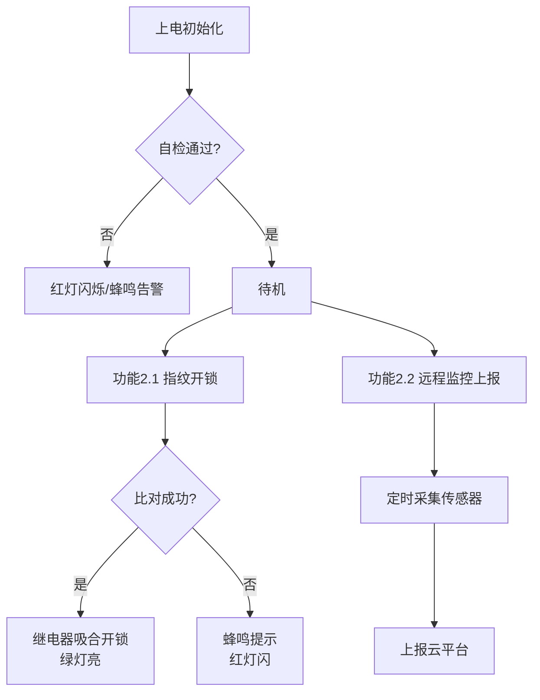

# 项目功能与硬件整理规范

`/organize-features`、`/organize-hardware`、`/organize-pinout` 三个命令的执行规范与输出模板。整理来源：源码（初始化代码、驱动、任务/状态机）、原理图/README/注释、配置文件（如 CubeMX .ioc、sdkconfig、platformio.ini）。所有结论必须能在项目中找到出处，不确定的条目标注「待确认」。

## 1. 功能点整理（/organize-features）

要求：
- 覆盖项目全部功能，不遗漏（按模块/任务/中断/通信协议逐一排查）
- 采用 `1 / 1.1 / 1.2 / 2 / 2.1` 分级编号：一级为功能模块，二级为具体功能点，必要时用三级（1.1.1）拆分细节
- 每个功能点写清：做什么、触发条件/入口（函数或任务名）、涉及的硬件
- 输出到 `output://docs/features.md`（或用户指定位置）

输出模板：

```markdown
# 项目功能清单

## 1 数据采集
### 1.1 温湿度采集
- 说明：每 5s 读取一次 SHT30 温湿度
- 入口：`sensor_task()` → `sht30_read()`
- 硬件：SHT30（I2C1）
### 1.2 电池电压监测
- 说明：ADC 分压采样，低于 3.3V 触发低电告警
- 入口：`battery_monitor_task()`
- 硬件：分压电阻 + ADC1_IN5

## 2 显示与交互
### 2.1 OLED 状态显示
...
### 2.2 按键设置
...

## 3 通信上报
### 3.1 WiFi MQTT 上报
...
```

## 2. 硬件清单整理（/organize-hardware）

要求：
- 列出项目使用的**全部**硬件：MCU（型号/主频/Flash/RAM/封装）、传感器、执行器、显示、通信模块、存储、电源器件
- 每项写明：型号、接口类型、用途、数量、对应驱动文件
- 输出到 `output://docs/hardware.md`（或与功能清单同文件的独立章节）

输出模板：

```markdown
# 硬件清单

## MCU
| 项 | 内容 |
|---|---|
| 型号 | STM32F103C8T6 |
| 内核/主频 | Cortex-M3 / 72MHz |
| Flash / RAM | 64KB / 20KB |
| 封装 | LQFP48 |
| 开发环境 | STM32CubeIDE + HAL |

## 外设器件
| 序号 | 器件 | 型号 | 接口 | 用途 | 数量 | 驱动文件 |
|---|---|---|---|---|---|---|
| 1 | 温湿度传感器 | SHT30 | I2C1 | 环境监测 | 1 | `sht30.c` |
| 2 | OLED | SSD1306 0.96" | I2C1 | 状态显示 | 1 | `oled.c` |
| 3 | WiFi 模块 | ESP-01S | USART2 (AT) | 数据上报 | 1 | `wifi_at.c` |
| 4 | 电源 | AMS1117-3.3 | - | 5V→3.3V | 1 | - |
```

## 3. 硬件引脚整理（/organize-pinout）

要求：
- **单独成表**，按 MCU 引脚逐一列出所有已占用引脚，未用引脚可汇总为一行
- 每行写明：MCU 引脚、复用功能（AF）、方向、连接器件与器件侧引脚、备注（上拉/下拉、电平、中断）
- 同一总线多器件的（如 I2C 挂多个从机）在备注中列出各从机地址
- 检查并标注引脚冲突（同一引脚被多处初始化）
- 输出到 `output://docs/pinout.md`

输出模板：

```markdown
# 引脚分配表

MCU：STM32F103C8T6（LQFP48）

| MCU 引脚 | 功能 | 方向 | 连接器件.引脚 | 备注 |
|---|---|---|---|---|
| PB6 | I2C1_SCL | 复用开漏 | SHT30.SCL / SSD1306.SCL | 4.7kΩ 上拉；从机 0x44 / 0x3C |
| PB7 | I2C1_SDA | 复用开漏 | SHT30.SDA / SSD1306.SDA | 4.7kΩ 上拉 |
| PA2 | USART2_TX | 复用推挽 | ESP-01S.RX | 115200 8N1 |
| PA3 | USART2_RX | 输入 | ESP-01S.TX | |
| PA5 | ADC1_IN5 | 模拟输入 | 电池分压中点 | 100k/100k 分压 |
| PA0 | GPIO_EXTI0 | 输入 | 按键 KEY1 | 内部上拉，下降沿中断 |
| PC13 | GPIO 输出 | 推挽 | 板载 LED | 低电平点亮 |
| 其余 | 未使用 | - | - | 建议配置为模拟输入省电 |

## 引脚冲突检查
- 无冲突 / 列出冲突项与出处
```

## 4. 使用说明文档生成（/organize-manual）

要求：
- 生成面向使用者的 Markdown 使用说明，输出到 `output://docs/manual.md`（或用户指定位置）
- 内容基于已整理的功能清单、硬件清单、引脚表（若尚未整理，先执行相应整理）
- 语言面向使用者而非开发者：写"怎么用"，不堆砌实现细节

输出模板：

```markdown
# XXX 项目使用说明

## 1 项目简介
一句话说明项目用途 + 主要功能概览（引用功能清单一级条目）。

## 2 硬件准备
- 所需硬件清单（型号 + 数量，引用 hardware.md）
- 接线说明（引用 pinout.md 关键引脚，可配接线图）

## 3 环境搭建与烧录
### 3.1 开发环境
工具链、依赖版本、安装步骤。
### 3.2 编译与烧录
逐步命令/操作，含烧录器连接方式。

## 4 功能使用
按功能清单逐项说明操作方法与预期现象：
### 4.1 温湿度采集
上电后每 5s 自动采集，OLED 第一行显示……
### 4.2 按键设置
短按 KEY1 切换页面，长按 3s 进入设置……

## 5 指示与提示
LED / 蜂鸣器 / 屏幕各状态含义对照表。

## 6 常见问题 (FAQ)
| 现象 | 可能原因 | 处理方法 |
|---|---|---|

## 7 版本与维护
固件版本、更新方式、维护人。
```

## 5. 信息来源优先级

1. 代码中的引脚初始化（`MX_GPIO_Init`、`gpio_config`、`pinMode` 等）与宏定义（`#define LED_PIN ...`）
2. CubeMX `.ioc` / `pins_arduino.h` / devicetree 等配置文件
3. 原理图、README、注释
4. 以上冲突时直接以**实际代码**为准写入，仅在对应条目备注中简要标注不一致处；不要为不一致项生成单独的"待确认清单"或暂停等待用户裁决——文档生成不是文档比对，除非用户明确要求核对文档差异

## 6. 单文件汇总（/organize-manual-single）

将功能清单、硬件清单和使用说明合并到**同一个 Markdown 文件**，产出面向**最终用户**的项目手册：读者可能完全不懂代码，只写用户视角需要的信息。章节标题统一升级一级（原 `#` 变为 `##`），顶部增加项目概述章节。

与分文件产出的差异：

- **不含引脚分配表章节**：引脚信息仅内部用于核对接线说明，逐脚列表与冲突检查只在 `/organize-pinout`、`/organize-docs` 中输出
- **不含旧文档不一致的备注或汇总附录**：不一致处按代码写入正文，差异只在会话结果汇报中简要提及
- 功能清单用用户视角描述，表格不列驱动文件等代码细节

输出模板：

```markdown
# {项目名} 项目手册

> 生成时间：{日期}
> 整合功能清单、硬件清单和使用说明。

---

## 1. 项目概述

一句话说明项目用途 + 架构简图 + 主要功能概览。

### 技术栈

| 项目 | 说明 |
|------|------|
| MCU | {型号} |
| 库/框架 | {HAL/标准库/Arduino} |
| 通信协议 | {I2C/SPI/UART/...} |

---

## 2. 功能清单

### 2.1 {功能模块一}

| 编号 | 功能 | 说明 |
|------|------|------|
| 2.1.1 | {具体功能} | {用户视角的行为描述} |

### 2.2 {功能模块二}
...

---

## 3. 硬件清单

### 3.1 MCU

| 项 | 内容 |
|----|------|
| 型号 | {型号} |
| 内核/主频 | {内核} / {主频} |
| Flash / RAM | {Flash} / {RAM} |

### 3.2 外设器件

| 序号 | 器件 | 型号 | 接口 | 用途 |
|------|------|------|------|------|

---

## 4. 使用说明

### 4.1 硬件准备与接线
所需硬件清单 + 面向用户的接线说明（哪根线接哪个端子，不写寄存器/引脚初始化细节）。

### 4.2 环境搭建与烧录
工具链、编译命令、烧录方式。

### 4.3 功能使用
按功能清单逐项说明操作方法与预期现象。

### 4.4 指示与提示
LED / 蜂鸣器 / 屏幕各状态含义对照表。

### 4.5 常见问题 (FAQ)

| 现象 | 可能原因 | 处理方法 |
|------|----------|----------|

---

## 5. 系统流程图

（Mermaid flowchart，见下方要求）
```

**流程图要求（第 5 章）**：

- 用 Mermaid `flowchart TD` 绘制，**以功能为主线**：每个主要功能（对应第 2 章功能编号）画出"触发 → 处理 → 判断分支 → 结果/提示"的路径，多个功能可共用起点（如上电初始化）后分支
- 节点用用户能看懂的语言（如"按下指纹→比对成功？→开锁/蜂鸣提示"），不写函数名、寄存器
- 判断用菱形分支并标注 是/否；关键状态提示（LED/屏幕/蜂鸣器）作为结果节点
- 功能多时可拆成多个小流程图（每个功能模块一张），避免单图过大
- Mermaid 代码块可直接在 Typora/VS Code/GitHub 渲染；转图片：`npx -y @mermaid-js/mermaid-cli -i docs/project-manual.md -o docs/flow.png` 或到 mermaid.live 粘贴导出 PNG/SVG，把这条转换说明作为注释附在流程图代码块之后

示例骨架：

````markdown

````

**单文件汇总要点**：
- 章节编号统一：概述=1，功能=2，硬件=3，使用说明=4，流程图=5
- 各章节间交叉引用用编号而非文件名（如"见第 3 节"而非"见 hardware.md"）
- 大型项目（功能 > 30 项或引脚 > 40 个）建议用 `/organize-docs` 分文件输出，避免单文件过长
